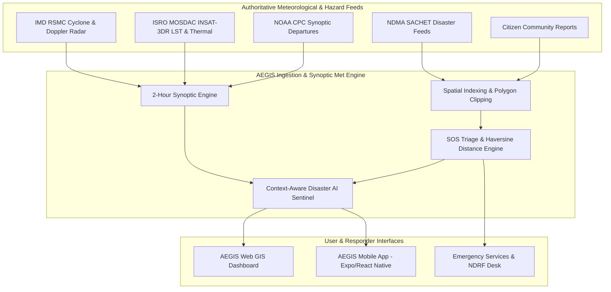

# AEGIS ALERT — Autonomous Emergency Geospatial Intelligence & Safety Sentinel

[](https://opensource.org/licenses/MIT)
[](https://www.typescriptlang.org/)
[](https://reactjs.org/)
[](https://fastapi.tiangolo.com/)
[](https://sachet.ndma.gov.in/)
[](https://mausam.imd.gov.in/)

**AEGIS Alert** is an AI-powered, multi-hazard early warning, real-time meteorological GIS tracking, and emergency distress beacon dispatch platform built for the Indian subcontinent. It aggregates satellite, radar, anemometer, and synoptic telemetry to deliver hyper-localized risk intelligence and coordinates life-saving emergency responses.

---

## 📑 Table of Contents

1. [Architectural Overview & Flow](#-architectural-overview--flow)
2. [Technical Approach & Algorithmic Design](#-technical-approach--algorithmic-design)
3. [Core Capabilities & Use Cases](#-core-capabilities--use-cases)
4. [Environmental & Research Maps](#-environmental--research-maps)
5. [NDMA SACHET Multi-Hazard Safety Hub](#-ndma-sachet-multi-hazard-safety-hub)
6. [Offline-First SOS & Beacon Triaging](#-offline-first-sos--beacon-triaging)
7. [References & Scientific Grounding](#-references--scientific-grounding)
8. [Getting Started & Local Deployment](#-getting-started--local-deployment)

---

## 🔄 Architectural Overview & Flow

AEGIS Alert operates on a closed-loop disaster lifecycle pipeline spanning telemetry ingestion, AI risk correlation, citizen alerting, and responder tactical dispatch:



---

## 🛠️ Technical Approach & Algorithmic Design

### 1. 2-Hour Synoptic Meteorological Cadence
- In accordance with standard World Meteorological Organization (WMO) and India Meteorological Department (IMD) observation cycles, atmospheric conditions, anemometers, and cyclone advisories are synchronized on **discrete 2-hour synoptic time steps** (`-18h`, `-12h`, `-6h`, `NOW`, `+6h`, `+12h`, `LANDFALL`).
- Automatic countdown timer triggers real-time data cache invalidation and UI state synchronization.

### 2. High-Precision Geo-Spatial Interpolation
- **Cyclone Tracking Spline**: Real-time eye coordinates, sustained wind speeds, central pressure, gale radius circles, and the **Cone of Uncertainty polygon** are interpolated smoothly to maintain physical continuity.
- **Continuous Temperature Anomaly Contours**: Closed coordinate polygons across all meteorological subdivisions of India (NOAA CPC / IMD NCC format) visualize real-time surface temperature departures (from severe heatwaves $>+5^\circ\text{C}$ to convective cloud cooling $<-3^\circ\text{C}$).

### 3. Triage & Dispatch Automation
- **Haversine Proximity Calculation**: Computes geodesic distance from active emergency responders and nearest state emergency operations centers (SEOC) to stranded citizens.
- **Battery & Signal Telemetry**: Encodes victim phone battery percentage, network signal strength, medical priority, and occupant headcount in every distress packet.

---

## 🌟 Core Capabilities & Use Cases

### 1. Citizen Safety & Early Warning
- **Hyper-Localized Risk Scoring**: 0–100 risk score based on real-time atmospheric, flood, lightning, and seismic conditions at the user's GPS coordinates.
- **Multilingual Emergency Hotlines**: Direct 1-tap connection to `112` (Unified National Emergency), `1078` (NDMA HQ), `1070` (State Relief Commissioner), and `1554` (Indian Coast Guard SAR).

### 2. Real-Time Meteorological Research GIS
- 7 dedicated, isolated environmental maps accessible with simple, clean naming:
  - `cyclone maps`: Active tropical cyclone tracking (currently tracking **Very Severe Cyclonic Storm ARNAB** in Bay of Bengal).
  - `wind maps`: Full atmospheric wind streamlines, anemometer arrays, and gale corridors.
  - `weather maps`: District-level weather condition markers and state selectors.
  - `doppler maps`: Doppler Weather Radar (DWR) precipitation reflectivity ($dBZ$).
  - `satellite maps`: High-resolution satellite imagery layers.
  - `thermal anomaly maps`: Synoptic land surface temperature departure contours.
  - `street maps`: High-contrast geographical navigation base layer.

### 3. Dedicated SOS Maps & Rescue Dispatch
- Complete separation of distress beacons from research layers.
- Real-time GPS beacon markers with animated radar pulse indicators.
- Interactive victim profile inspection modal with emergency speed-dial actions.

---

## 🛡️ NDMA SACHET Multi-Hazard Safety Hub

Directly aligned with NDMA’s official SACHET guidance and Ministry of Road Transport and Highways (MoRTH) standards, the **Safety Hub** provides structured SOPs for 7 major hazards:

| Hazard Protocol | Verified Authority | Official Safety Video Action |
| :--- | :--- | :--- |
| **Flood Disaster Safety** | NDMA SACHET | [Watch Flood Safety Video](https://sachet.ndma.gov.in/DosDont) |
| **Cyclone & Gale Storm Safety** | NDMA SACHET | [Watch Cyclone Safety Video](https://sachet.ndma.gov.in/DosDont) |
| **Earthquake & Seismic Hazard** | NDMA SACHET | [Watch Earthquake Safety Video](https://sachet.ndma.gov.in/DosDont) |
| **Landslide & Debris Flow Safety** | NDMA SACHET | [Watch Landslide Safety Video](https://sachet.ndma.gov.in/DosDont) |
| **Road Safety & Highway Hazards** | MoRTH | [Watch Road Safety Video](https://morth.nic.in/road-safety) |
| **Lightning & Severe Thunderstorm** | NDMA SACHET | [Watch Lightning Safety Video](https://sachet.ndma.gov.in/DosDont) |
| **Ocean & Coastal Maritime Hazards** | NDMA SACHET | [Watch Coastal Safety Video](https://sachet.ndma.gov.in/DosDont) |

---

## 📚 References & Scientific Grounding

1. **National Disaster Management Authority (NDMA)**: [SACHET Multi-Hazard Early Warning Portal](https://sachet.ndma.gov.in/)
2. **India Meteorological Department (IMD)**: [RSMC Tropical Cyclones New Delhi & Mausam Portal](https://mausam.imd.gov.in/)
3. **ISRO MOSDAC**: [INSAT-3DR Multispectral Satellite & Land Surface Temperature](https://mosdac.gov.in/)
4. **NOAA Climate Prediction Center (CPC)**: [Global Temperature & Precipitation Anomalies](https://www.cpc.ncep.noaa.gov/)
5. **Ministry of Road Transport and Highways (MoRTH)**: [National Road Safety Guidelines](https://morth.nic.in/road-safety)
6. **Leaflet & OpenStreetMap**: [Open Geospatial Consortium Standards](https://www.openstreetmap.org/)

---

## 🚀 Getting Started & Local Deployment

### Prerequisites
- Node.js (v18+)
- Python (3.11+)

### 1. Web Dashboard
```bash
cd web
npm install
npm run dev
# Dashboard opens on http://localhost:5173
```

### 2. Backend API
```bash
cd backend
python -m venv venv
source venv/bin/activate  # On Windows: venv\Scripts\activate
pip install -r requirements.txt
uvicorn app.main:app --reload --port 8000
# API docs available on http://localhost:8000/docs
```

### 3. Mobile App
```bash
cd mobile
npm install
npx expo start
```

---

## 📄 License
This project is licensed under the MIT License — see the [LICENSE](LICENSE) file for details.
