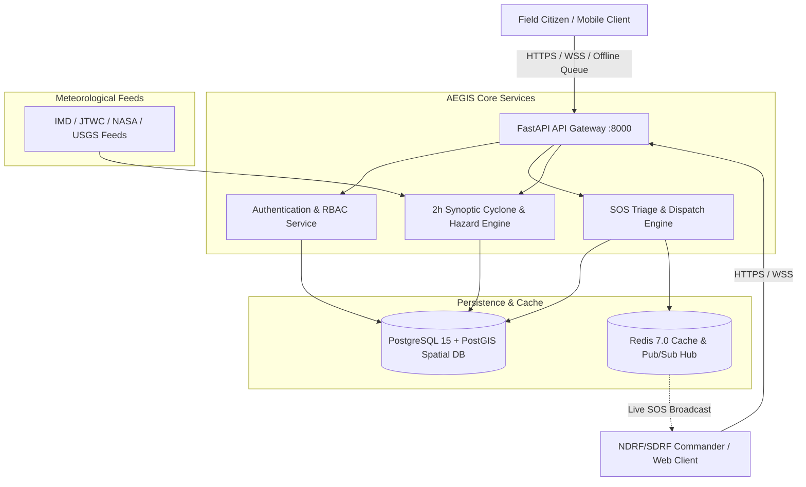

# AEGIS ? Advanced Emergency Geocoded Information System

**AEGIS** is a resilient, offline-first disaster response and emergency command ecosystem engineered for life-safety operations during severe meteorological and geological hazards. Developed for the **Smart India Hackathon**, AEGIS unifies citizen distress signaling, real-time synoptic meteorological tracking, and emergency command-center dispatch into a single high-availability platform.

---

## 1. Overview & Problem Statement

### 1.1 The Challenge
During extreme natural disasters?such as tropical cyclones in the Bay of Bengal, flash floods, or seismic tremors?traditional communication networks frequently collapse. High-density telecommunication towers lose grid power, fiber infrastructure severs, and public control rooms become overwhelmed by uncoordinated, unverified distress calls. Emergency response agencies (NDRF, SDRF, District Disaster Management Authorities) struggle with:
1. Inaccurate or drifting citizen GPS coordinates.
2. Lack of high-fidelity, real-time spatial context connecting meteorological hazard zones (e.g. cyclone wind isotachs) to trapped victims.
3. Total inability of standard mobile applications to queue and transmit distress beacons in zero-connectivity environments.

### 1.2 The AEGIS Solution
AEGIS bridges this operational gap through:
- **Resilient Mobile App**: Built with an offline-first durable SQLite outbox, 3-second guarded SOS triggers, precision GPS telemetry with HDOP filtering, and offline NDMA SACHET safety guidelines.
- **Web Tactical Command Center**: A multi-layered GIS command console providing real-time triage maps, responder dispatch workflows, and 7 specialized simple-named hazard research maps (Cyclone, Doppler Radar, Thermal Anomaly, Wind Hazard, Satellite, Precipitation, and Seismic).
- **FastAPI Synoptic Backend**: High-throughput asynchronous ASGI microservice running a 2-hour synoptic meteorological engine with Catmull-Rom spline wind interpolation for Cyclone Arnab, PostGIS spatial indexing, and Redis Pub/Sub WebSocket broadcasting.

---

## 2. System Architecture



---

## 3. System Component Catalog

| Component | Responsibility | Technology Stack | Operational Status |
|---|---|---|---|
| **Mobile Client** | Citizen emergency beacon trigger, GPS telemetry, offline NDMA guidelines | React Native, Expo, WatermelonDB / SQLite | **Implemented** |
| **Web Command Center** | Control-room GIS triage, victim beacon tracking, responder dispatch, 7 research maps | React 18, Vite, TypeScript, Leaflet, Tailwind CSS | **Implemented** |
| **Backend API Gateway** | Asynchronous REST endpoints, WebSocket hubs, RBAC middleware | Python 3.11, FastAPI, Pydantic v2, SQLAlchemy | **Implemented** |
| **Synoptic Hazard Engine** | 2-hour meteorological step tracking, Catmull-Rom spline wind isotachs for Cyclone Arnab | Python, NumPy, Shapely, GeoJSON | **Implemented** |
| **Spatial Database** | Relational user records, tactical SOS beacons, PostGIS spatial geometries | PostgreSQL 15, PostGIS 3.3 | **Implemented** |
| **Telemetry Cache & Broker** | Sub-millisecond SOS queue buffer, WebSocket connection state, Pub/Sub | Redis 7.0 | **Implemented** |
| **AI Risk Sentinel** | Multi-hazard threat scoring and vulnerability index synthesis | Python, Scikit-learn, Heuristic Matrix | **Partially Implemented** |
| **LoRa Mesh Gateway** | Off-grid hardware emergency radio packet relay | LoRa / Serial Bridge Protocol | **Planned** |

---

## 4. The 7 Specialized Hazard Research Maps

To prevent cognitive overload during catastrophic crisis events, AEGIS classifies spatial meteorological and geological data into 7 simply-named, dedicated GIS layers:

1. **Cyclone Map**: Real-time eye track of Cyclone Arnab in the Bay of Bengal, 2-hour synoptic steps, cone of uncertainty, and spline-interpolated wind isotach contours (65 to 180 km/h).
2. **Doppler Radar Map**: Composite radar reflectivity rings (dBZ) and 250 km coastal surveillance radii for real-time storm core detection.
3. **Thermal Anomaly Map**: MODIS/VIIRS infrared thermal hotspot clusters indicating industrial flare-ups or forest fire vectors.
4. **Wind Hazard Map**: Dynamic atmospheric streamline vectors and 10m surface wind pressure gradients.
5. **Satellite Map**: INSAT-3D / 3DR multispectral infrared and visible cloud top temperature dynamics.
6. **Precipitation Map**: Cumulative surface rainfall (mm/hr) and severe convective cloudburst warning polygons.
7. **Seismic Map**: USGS / NCS National Seismological Network earthquake epicenters and tectonic fault lines.

---

## 5. Repository Structure

```text
AEGIS/
??? docs/                                # Comprehensive Technical Documentation
?   ??? diagrams/                        # 10 Standalone Mermaid Architecture Files
?   ??? SYSTEM_ARCHITECTURE.md           # End-to-end system context & component breakdown
?   ??? MOBILE_APP.md                    # Mobile application screens, GPS, & offline storage
?   ??? WEB_APP.md                       # Web GIS command center & 7 research maps
?   ??? BACKEND.md                       # FastAPI ASGI engine & synoptic processor
?   ??? API_DOCUMENTATION.md             # Complete REST & WebSocket endpoint contracts
?   ??? DATABASE.md                      # PostGIS ER schema, catalogs, & indexing
?   ??? AUTHENTICATION.md                # JWT dual-token & Argon2id RBAC security
?   ??? LOCATION_AND_MAPS.md             # GPS telemetry, HDOP filtering, & GIS pipelines
?   ??? SOS_AND_EMERGENCY_FLOW.md        # End-to-end SOS lifecycle & triage priority
?   ??? OFFLINE_ONLINE_ARCHITECTURE.md   # Offline durable outbox & LWW sync model
?   ??? SECURITY.md                      # Threat model, encryption, & privacy controls
?   ??? DEPLOYMENT.md                    # Docker compose, Nginx, & cloud infrastructure
?   ??? TESTING.md                       # Verification pyramid & test execution matrix
?   ??? MONITORING.md                    # Prometheus health probes & structured logging
?   ??? CONTRIBUTING.md                  # Developer guidelines & commit standards
?   ??? CHANGELOG.md                     # Release history & version notes
?   ??? PROJECT_STATUS.md                # SIH requirement vs implementation audit
??? web/                                 # Web Command Center (React, Vite, Leaflet)
??? mobile/                              # Mobile Citizen App (React Native, Expo)
??? server/                              # FastAPI Backend Microservices & PostGIS
??? docker-compose.yml                   # Production container orchestration
??? README.md                            # Project Master Readme
```

---

## 6. Installation & Local Setup

### 6.1 Prerequisites
- **Node.js**: v20.x or higher + `npm`
- **Python**: v3.11 or higher
- **Docker & Docker Compose**: v24.x or higher
- **PostgreSQL**: v15 with PostGIS extension (or run via Docker)

### 6.2 Running Backend Services
```bash
# Clone the repository
git clone https://github.com/25A31A0356/aegis-alert.git
cd AEGIS/server

# Create and activate Python virtual environment
python -m venv venv
# Windows:
.\venv\Scripts\activate
# Linux/macOS:
source venv/bin/activate

# Install dependencies
pip install -r requirements.txt

# Launch FastAPI development server with hot-reload
uvicorn app.main:app --host 0.0.0.0 --port 8000 --reload
```

### 6.3 Running Web Command Center
```bash
cd ../web

# Install frontend dependencies
npm install

# Launch Vite development server
npm run dev
# Web Console opens at: http://localhost:5173
```

### 6.4 Running Mobile Application
```bash
cd ../mobile

# Install mobile dependencies
npm install

# Start Expo development server
npx expo start
```

---

## 7. Documentation Cross-Reference Index

For deep architectural, API, and engineering specifications, consult the dedicated documentation modules:

- [System Architecture](file:///docs/SYSTEM_ARCHITECTURE.md)
- [Mobile Application Engineering](file:///docs/MOBILE_APP.md)
- [Web Command Center & GIS](file:///docs/WEB_APP.md)
- [Backend Services & Synoptic Engine](file:///docs/BACKEND.md)
- [API & WebSocket Specification](file:///docs/API_DOCUMENTATION.md)
- [Database Schema & PostGIS Catalogs](file:///docs/DATABASE.md)
- [Authentication & RBAC](file:///docs/AUTHENTICATION.md)
- [Location Services & 7 Research Maps](file:///docs/LOCATION_AND_MAPS.md)
- [SOS Distress & Triage Lifecycle](file:///docs/SOS_AND_EMERGENCY_FLOW.md)
- [Offline-First & Resilience Architecture](file:///docs/OFFLINE_ONLINE_ARCHITECTURE.md)
- [Security Controls & Cryptography](file:///docs/SECURITY.md)
- [Deployment & Docker Orchestration](file:///docs/DEPLOYMENT.md)
- [Testing & Quality Verification Matrix](file:///docs/TESTING.md)
- [Project Implementation Status Matrix](file:///docs/PROJECT_STATUS.md)

---

## 8. License & Academic Attribution
Developed for the **Smart India Hackathon (SIH)**. Meteorological methodologies adhere to standard synoptic guidelines established by the India Meteorological Department (IMD) and World Meteorological Organization (WMO). Safety guidelines are aligned with the National Disaster Management Authority (NDMA) SACHET initiative.
