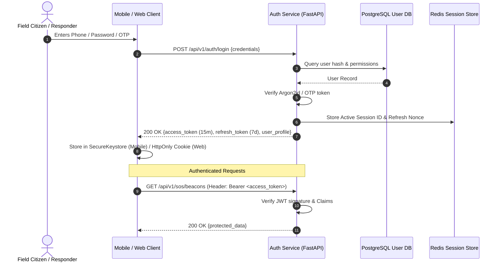

# AEGIS Authentication & Authorization Specification

This document provides technical specifications for identity verification, cryptographic token lifecycles, role-based access control (RBAC), and session security across the AEGIS ecosystem.

## 1. Authentication Architecture Overview

AEGIS utilizes stateless JWT (JSON Web Tokens) with a dual-token mechanism (short-lived access tokens + cryptographically rotated refresh tokens) paired with multi-factor OTP verification for field citizens.



---

## 2. Token Lifecycle & Specifications

### 2.1 Access Token (JWT)
- **Algorithm**: `HS256` (Development) / `RS256` (Production asymmetric key pair).
- **TTL**: 15 minutes (900 seconds).
- **Claims Structure**:
```json
{
  "sub": "3fa85f64-5717-4562-b3fc-2c963f66afa6",
  "phone": "+919876543210",
  "role": "responder",
  "jurisdiction": "IN-AP",
  "iat": 1790400000,
  "exp": 1790400900,
  "jti": "c62b9f6b-8b9a-412e-a39c-5e5d16e026c4"
}
```

### 2.2 Refresh Token
- **Entropy**: 256-bit cryptographically secure random string.
- **TTL**: 7 days.
- **Rotation Rule**: Every refresh request invalidates the previous refresh token and issues a new pair. If a revoked refresh token is reused, all sessions for that user ID are immediately revoked (replay attack defense).

---

## 3. Role-Based Access Control (RBAC) Matrix

| Resource / Action | Citizen | Responder (NDRF/SDRF) | Analyst | Administrator |
|---|---|---|---|---|
| Trigger / Cancel Personal SOS | **Allow** | **Allow** | **Allow** | **Allow** |
| View Global SOS Beacons | Deny | **Allow** (Assigned Sector) | **Allow** (Read-Only) | **Allow** (Full Access) |
| Acknowledge / Dispatch Rescue | Deny | **Allow** | Deny | **Allow** |
| Access Real-Time Hazard Contours | **Allow** (Public View) | **Allow** (Tactical View) | **Allow** (Raw Synoptic Data) | **Allow** (Full Control) |
| Override Synoptic Simulation | Deny | Deny | **Allow** | **Allow** |
| User Management & System Config | Deny | Deny | Deny | **Allow** |

---

## 4. Mobile & Web Credential Storage

| Client Platform | Access Token Storage | Refresh Token Storage | Security Rationale |
|---|---|---|---|
| **Mobile (React Native / Expo)** | `Expo SecureStore` / EncryptedSharedPreferences | `Expo SecureStore` / iOS Keychain | Hardware-backed hardware security module (HSM) isolation. |
| **Web (Vite / React)** | In-Memory (Zustand Auth Store) | Secure `HttpOnly`, `SameSite=Strict` Cookie | Protects against XSS scraping of long-lived tokens. |

---

## 5. Security Controls & Secrets Policy
- **Zero Raw Passwords**: All passwords salted and hashed using Argon2id.
- **Zero Hardcoded Secrets**: Secrets injected exclusively via `AEGIS_JWT_SECRET_KEY` environment variables.
