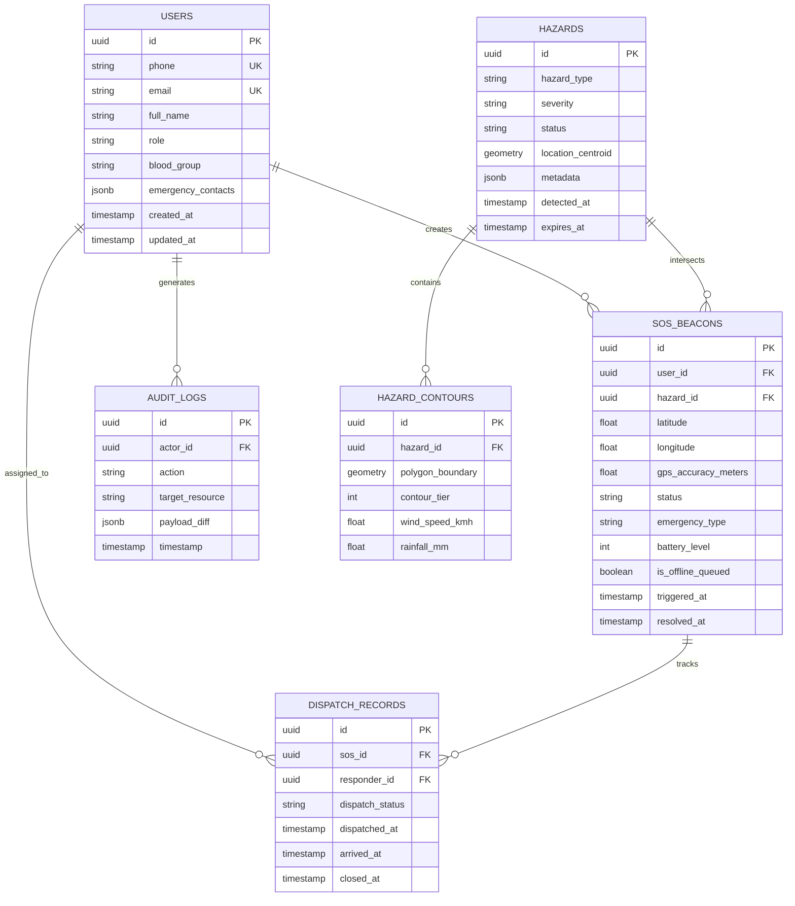

# AEGIS Database Architecture & Schema Specification

This document details the data storage architecture, schemas, entities, indexing strategies, and migration plans for the AEGIS Disaster Response Platform.

## 1. Storage Paradigm Overview

AEGIS utilizes a hybrid multi-tier persistence model:

1. **Relational Core (PostgreSQL 15+)**: Primary relational persistence for users, disaster incidents, tactical SOS beacons, responder dispatch logs, and spatial hazard contours.
2. **Key-Value & Ephemeral Cache (Redis 7.0)**: Sub-millisecond store for real-time responder telemetry, active SOS geolocation buffers, WebSocket connection maps, and rate limiting counters.
3. **Client-Side Embedded Storage**:
   - **Mobile (React Native)**: WatermelonDB / SQLite paired with `@react-native-async-storage/async-storage` for offline queueing, local hazard advisories, and cached NDMA guidelines.
   - **Web (Vite/React)**: IndexedDB (Dexie.js abstraction) + `localStorage` for offline triage states and session persistence.

---

## 2. Entity-Relationship Diagram



---

## 3. Schema Definitions & Table Catalogs

### 3.1 `users` Table
Stores verified citizen profiles, emergency response personnel, and control-room administrators.

| Column | Type | Constraints | Description | Status |
|---|---|---|---|---|
| `id` | `UUID` | `PRIMARY KEY, DEFAULT gen_random_uuid()` | Unique entity identifier | Implemented |
| `phone` | `VARCHAR(15)` | `UNIQUE, NOT NULL` | Verified E.164 phone number | Implemented |
| `email` | `VARCHAR(255)` | `UNIQUE, NULLABLE` | Optional contact email | Implemented |
| `password_hash` | `VARCHAR(255)` | `NOT NULL` | Argon2id / bcrypt hash | Implemented |
| `full_name` | `VARCHAR(128)` | `NOT NULL` | User legal name | Implemented |
| `role` | `VARCHAR(32)` | `NOT NULL, DEFAULT 'citizen'` | `citizen`, `responder`, `admin`, `analyst` | Implemented |
| `blood_group` | `VARCHAR(8)` | `NULLABLE` | Medical tag (e.g. `O+`, `B-`) | Implemented |
| `emergency_contacts` | `JSONB` | `DEFAULT '[]'` | Array of emergency contact numbers | Implemented |
| `created_at` | `TIMESTAMPTZ` | `DEFAULT NOW()` | Record insertion timestamp | Implemented |
| `updated_at` | `TIMESTAMPTZ` | `DEFAULT NOW()` | Last update timestamp | Implemented |

### 3.2 `sos_beacons` Table
High-frequency tactical emergency distress signals.

| Column | Type | Constraints | Description | Status |
|---|---|---|---|---|
| `id` | `UUID` | `PRIMARY KEY, DEFAULT gen_random_uuid()` | Distress signal identifier | Implemented |
| `user_id` | `UUID` | `FOREIGN KEY REFERENCES users(id)` | Initiating citizen identifier | Implemented |
| `latitude` | `DOUBLE PRECISION` | `NOT NULL` | WGS84 latitude coordinate | Implemented |
| `longitude` | `DOUBLE PRECISION` | `NOT NULL` | WGS84 longitude coordinate | Implemented |
| `gps_accuracy_meters` | `FLOAT` | `DEFAULT 0.0` | Mobile GPS HDOP error margin | Implemented |
| `status` | `VARCHAR(32)` | `DEFAULT 'TRIGGERED'` | `TRIGGERED`, `ACKNOWLEDGED`, `DISPATCHED`, `RESCUED`, `CANCELLED` | Implemented |
| `emergency_type` | `VARCHAR(64)` | `NOT NULL` | `CYCLONE_TRAPPED`, `FLOOD_EVAC`, `MEDICAL`, `COLLAPSE`, `GENERAL` | Implemented |
| `battery_level` | `INT` | `CHECK (battery_level BETWEEN 0 AND 100)` | Device battery at trigger | Implemented |
| `is_offline_queued` | `BOOLEAN` | `DEFAULT FALSE` | True if beacon was delayed in local SQLite queue | Implemented |
| `triggered_at` | `TIMESTAMPTZ` | `DEFAULT NOW()` | Client creation timestamp | Implemented |
| `resolved_at` | `TIMESTAMPTZ` | `NULLABLE` | Resolution timestamp | Implemented |

### 3.3 `hazards` & `hazard_contours` Tables
Spatial representations of active cyclones (Arnab), thermal hotspots, Doppler radar anomalies, and flood zones.

| Table | Column | Type | Description | Status |
|---|---|---|---|---|
| `hazards` | `id` | `UUID PK` | Primary identifier | Implemented |
| `hazards` | `hazard_type` | `VARCHAR(64)` | `CYCLONE`, `FLOOD`, `THERMAL_ANOMALY`, `SEISMIC`, `DOPPLER_PRECIPITATION` | Implemented |
| `hazards` | `severity` | `VARCHAR(32)` | `LOW`, `MODERATE`, `SEVERE`, `CATASTROPHIC` | Implemented |
| `hazards` | `location_centroid` | `GEOMETRY(Point, 4326)` | PostGIS centroid point | Implemented |
| `hazards` | `synoptic_period_utc` | `VARCHAR(32)` | 2-hour synoptic timestamp (e.g. `2026-09-26T12:00:00Z`) | Implemented |
| `hazard_contours` | `polygon_boundary` | `GEOMETRY(Polygon, 4326)` | PostGIS contour polygon | Implemented |
| `hazard_contours` | `wind_speed_kmh` | `FLOAT` | Contour wind speed (e.g., 65-180 km/h) | Implemented |

---

## 4. Indexing Strategy & Performance Tuning

1. **Spatial Indexes**:
   ```sql
   CREATE INDEX idx_hazards_centroid ON hazards USING GIST (location_centroid);
   CREATE INDEX idx_hazard_contours_poly ON hazard_contours USING GIST (polygon_boundary);
   ```
2. **SOS Status & Temporal Composite Index**:
   ```sql
   CREATE INDEX idx_sos_status_triggered ON sos_beacons (status, triggered_at DESC);
   ```
3. **User Phone Lookup**:
   ```sql
   CREATE UNIQUE INDEX idx_users_phone ON users (phone);
   ```

---

## 5. Migrations & Backup Strategy

- **Migration Framework**: Alembic (Python) for schema version control.
- **Migration Location**: `server/migrations/`
- **Backup Architecture (Production Plan)**:
  - Daily Automated Snapshots: Point-in-time recovery (PITR) via WAL archiving.
  - Geo-Replicated Backups: Off-site cold storage with AES-256 encryption.
