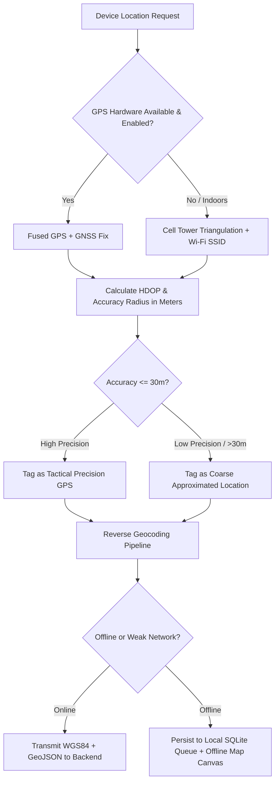
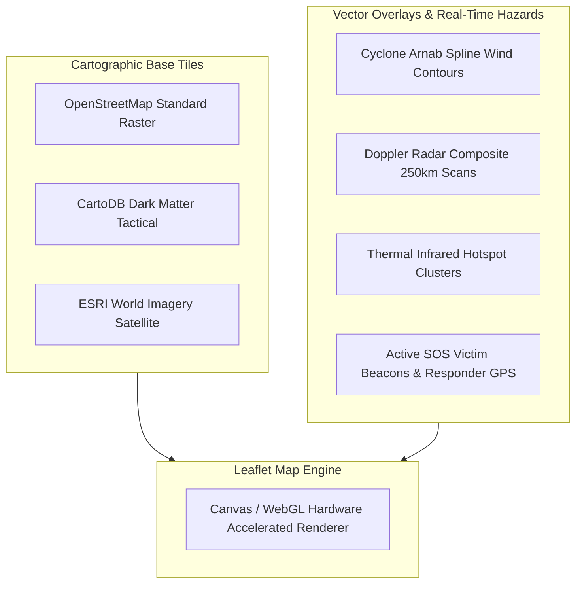

# AEGIS Location Services & GIS Map Architecture

This document details device location capture, precision telemetry, multi-tier spatial map rendering, and the 7 specialized scientific hazard maps supported in AEGIS.

## 1. Location Acquisition & Hardware Telemetry

AEGIS mobile clients obtain location coordinates through native platform Location Managers (`expo-location` and Google FusedLocationProvider / Apple CoreLocation).

### 1.1 Precision Pipeline & Degraded Modes

### 1.2 Geolocation Configuration
- **Accuracy Mode**: `LocationAccuracy.Highest` (mobile), providing sub-10m precision in open sky.
- **Update Frequency**:
  - *Standard Mode*: Interval = 30 seconds, Distance filter = 25 meters.
  - *Active SOS Mode*: Interval = 3 seconds, Distance filter = 2 meters.
- **Background Location**: Operates via native foreground services with persistent sticky notification to prevent OS killer daemons during emergency triage.

---

## 2. GIS Mapping Architecture & Cartographic Layers

The AEGIS Web Command Center and Mobile Map utilize **Leaflet** with hardware-accelerated SVG/Canvas rendering and custom tile providers.

---

## 3. The 7 Specialized Hazard & Research Maps

To prevent user confusion during catastrophic stress, maps are categorized with strict, simple naming conventions:

| # | Map Identifier | Research Data Source | Spatial Elements Displayed | Update Cycle |
|---|---|---|---|---|
| 1 | **Cyclone Map** | IMD Synoptic Cyclone Bulletins / JTWC | Cyclone Arnab eye track, historical points, cone of uncertainty, spline wind isotachs (65-180 km/h) | 2 Hours Synoptic |
| 2 | **Doppler Radar Map** | IMD Doppler Weather Radar Network | Radar reflectivity (dBZ) circles, precipitation cores, 250 km surveillance radius rings | 15 Minutes |
| 3 | **Thermal Anomaly Map** | MODIS / VIIRS Active Fire & Surface Temp | Thermal brightness temperature anomaly points, forest fire vectors, industrial burnoffs | 1 Hour |
| 4 | **Wind Hazard Map** | ECMWF / GFS 10m Wind Fields | Streamline vector particles, atmospheric pressure gradients, gust fronts | 2 Hours Synoptic |
| 5 | **Satellite Map** | INSAT-3D / INSAT-3DR Multispectral Imagery | Enhanced Infrared cloud top temperatures, Visible band cloud dynamics, water vapor channels | 30 Minutes |
| 6 | **Precipitation Map** | GPM IMERG / IMD AWS Gauge Grid | Cumulative surface rainfall (mm/hr), severe convective rainfall warning polygons | 1 Hour |
| 7 | **Seismic Map** | USGS / NCS National Seismological Network | Earthquake epicenters, hypocenter depths, seismic hazard fault line overlays | Real-Time Feed |

---

## 4. Offline Map Caching & Fallback Behavior

1. **Vector Caching**: When entering low-connectivity zones, base boundary GeoJSON files for districts, state evacuation shelters, and coastal zones remain cached in client memory.
2. **Offline Tile Storage**: High-priority tactical grids (zoom levels 10-14) for disaster-declared zones are saved to device local cache.
3. **Graceful Degradation**: If tiles fail to load, vector overlays (cyclone track, victim beacons, shelters) render directly over a clean vector canvas with grid coordinates.
