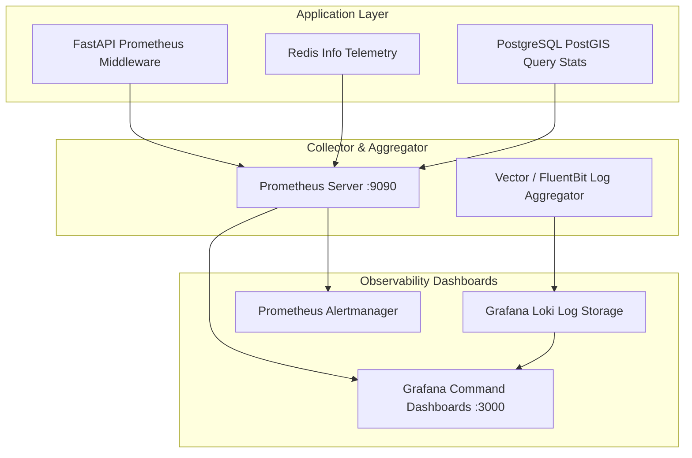

# AEGIS Observability, Telemetry & Operational Health

This document defines the monitoring architecture, health check probes, alerting thresholds, and structured logging standards for the AEGIS platform.

## 1. Observability Architecture



---

## 2. Health Check Endpoints

AEGIS exposes Kubernetes/Docker-compliant health probes:

| Endpoint | Method | Component Checked | Normal Response | Failure Response |
|---|---|---|---|---|
| `/healthz` | GET | Liveness probe (Process alive) | `200 OK {"status": "ok"}` | Connection Refused |
| `/readyz` | GET | Readiness probe (DB & Redis connected) | `200 OK {"status": "ready", "db": true, "redis": true}` | `503 Service Unavailable` |
| `/metrics` | GET | Prometheus Scrape Target | OpenMetrics format text | `500 Server Error` |

---

## 3. Structured Logging Standard

All backend services emit structured JSON logs to `stdout`:

```json
{
  "timestamp": "2026-09-26T14:30:15.123Z",
  "level": "INFO",
  "service": "aegis-backend",
  "trace_id": "8f3b14a2-9b23-45c1-840e-7d6f51a92e10",
  "event": "SOS_BEACON_ACKNOWLEDGED",
  "details": {
    "beacon_id": "c71a39f1-d0b8-4c8e-a220-3b91a921d194",
    "user_id": "3fa85f64-5717-4562-b3fc-2c963f66afa6",
    "hazard_zone": "CYCLONE_ARNAB_INNER_EYE",
    "duration_ms": 14.2
  }
}
```

---

## 4. Mission-Critical Alerting Thresholds

| Metric | Threshold | Severity | Operational Response |
|---|---|---|---|
| **SOS Beacon Ingestion Latency** | $> 500\text{ ms}$ for 1 minute | **P1 - Critical** | Page on-call reliability engineer immediately. Auto-scale backend worker pods. |
| **WebSocket Connection Drops** | $> 10\%$ drop over 30s | **P1 - Critical** | Investigate Redis Pub/Sub buffer exhaustion and edge proxy load. |
| **Synoptic Engine Stale Data** | $> 2.5\text{ hours}$ without synoptic update | **P2 - High** | Trigger manual fallback synoptic fetch from JTWC/NASA backup mirror. |
| **Database Connection Pool Saturation** | $> 85\%$ pool utilization | **P2 - High** | Increase connection pool limits / scale read replicas. |
