# AEGIS Offline-First & Resilient Synchronization Architecture

This document describes the offline-first engineering principles, local caching strategies, retry queues, and conflict resolution protocols implemented across the AEGIS ecosystem for operation in severely degraded or infrastructure-compromised disaster zones.

## 1. The Offline-First Imperative

During catastrophic weather events (such as Cyclone Arnab), cellular towers lose power, fiber lines sever, and network congestion spikes. AEGIS treats network loss as a normal operational state rather than an error exception.

```mermaid
stateDiagram-v2
    [*] --> ONLINE: App Boot with Internet
    
    state ONLINE {
        [*] --> FullSync
        FullSync: Download Weather Contours & Advisories
        FullSync --> LiveTelemetry: Open WebSocket & Transmit GPS
    }
    
    ONLINE --> NETWORK_DEGRADED: Latency > 2500ms or Packet Loss > 30%
    ONLINE --> OFFLINE: Socket Disconnect / No Interface
    
    state NETWORK_DEGRADED {
        [*] --> CompactPayloadMode
        CompactPayloadMode: Reduce Telemetry Rate (30s -> 120s)
        CompactPayloadMode: Disable Raster Tiles; Keep Vectors
    }
    
    NETWORK_DEGRADED --> OFFLINE: Full Disconnection
    NETWORK_DEGRADED --> ONLINE: Latency Restored < 500ms
    
    state OFFLINE {
        [*] --> LocalPersistence
        LocalPersistence: Read NDMA Guidelines from SQLite
        LocalPersistence: Read Cached Vector Shelters
        LocalPersistence --> SOS_Queued: User Triggers SOS
        SOS_Queued: Write to Durable Outbox Queue
    }
    
    OFFLINE --> ONLINE: Network Connectivity Re-established
    ONLINE --> BatchSync: Flush Durable Outbox
    BatchSync --> FullSync: Confirm Server ACK
```

---

## 2. Local Persistence Strategy

| Data Domain | Local Storage Engine | Max Cache Age | Offline Availability | Synchronization Policy |
|---|---|---|---|---|
| **SOS Outbox Queue** | SQLite / WatermelonDB | Infinite (until ACK) | Full (Can trigger SOS offline) | FIFO batch upload immediately upon network handshake |
| **NDMA Safety Guidelines** | Bundled JSON / SQLite | Permanent (App Build) | 100% Offline (Do's & Don'ts for 7 Hazards) | Version-checked during background updates |
| **Emergency Contacts** | Encrypted SQLite | Permanent | 100% Offline (Direct Phone/SMS triggers) | Client-side authoritative |
| **Synoptic Weather Cache** | IndexedDB / SQLite | 6 Hours | Vector polygons and latest 2h synoptic track | Delta sync upon reconnection |
| **Evacuation Shelters** | Local Spatial GeoJSON | 24 Hours | Full interactive map pins & offline routing vectors | Background refresh on Wi-Fi/LTE |

---

## 3. Outbox Queue & Synchronization Protocol

When an emergency event or incident report is generated offline:
1. **Durable Insertion**: The record is written with a unique UUID (`id`), local creation timestamp (`created_at_utc`), and `sync_status = 'PENDING'`.
2. **Connectivity Listener**: `@react-native-community/netinfo` (mobile) / `window.addEventListener('online')` (web) triggers the `SyncService.flushOutbox()` daemon.
3. **Exponential Backoff & Jitter**: Reconnection retries use exponential backoff:
   $$\text{Delay} = \min(60, 2^{\text{attempt}}) + \text{random}(0, 3) \text{ seconds}$$
4. **Idempotency Guarantee**: The backend uses the client-supplied UUID as an idempotency key (`X-Idempotency-Key`). Re-transmitted packets resulting from intermittent drops will not create duplicate SOS alerts.

---

## 4. Conflict Resolution Model

AEGIS implements a **Last-Write-Wins (LWW) with Role-Precedence** conflict resolution model:
- Citizen updates to personal medical notes or contact details resolve via standard LWW based on client timestamp.
- Field responder and Commander triage status updates (`DISPATCHED`, `RESCUED`) strictly override citizen client-state regardless of network delay.
