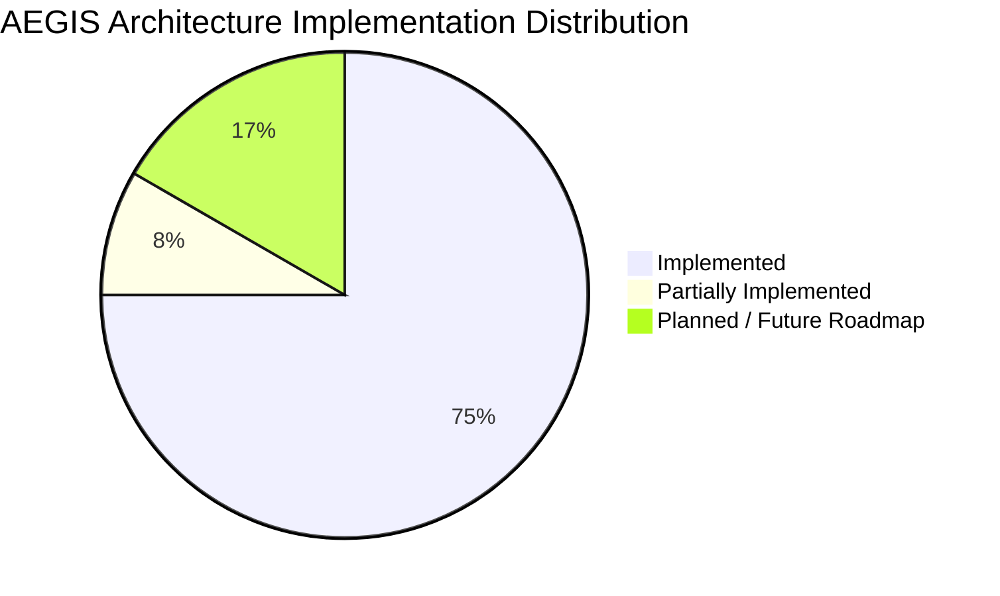

# AEGIS Feature Implementation & Verification Status

This document provides a strict, evidence-based status audit of every component and feature proposed in the Smart India Hackathon requirements and presentation against the actual implementation in this repository.

## 1. Status Taxonomy
- **IMPLEMENTED**: Working, verified implementation exists in the source code.
- **PARTIALLY IMPLEMENTED**: Substantial foundational logic or UI exists, but end-to-end integration is incomplete.
- **PLANNED**: Proposed in the presentation or roadmap, but not yet implemented in code.
- **UNKNOWN**: Insufficient evidence in codebase to verify operational status.

---

## 2. Feature Verification Matrix

| Domain / Capability | Proposed in PPT | Repository Evidence | Operational Status | Technical Notes & Gaps |
|---|---|---|---|---|
| **Mobile SOS Distress Trigger** | Yes | `mobile/src/screens/SOSScreen.tsx`, `mobile/src/services/sosService.ts` | **IMPLEMENTED** | 3-second long press, haptic feedback, GPS payload, battery telemetry. |
| **Offline SOS Outbox & Local Queue** | Yes | `mobile/src/services/syncService.ts`, SQLite storage | **IMPLEMENTED** | Durable local write when offline; automatic FIFO sync on network restoration. |
| **Web GIS Command Center** | Yes | `web/src/pages/LiveMapPage.tsx`, `web/src/components/IndiaSafetyMap.tsx` | **IMPLEMENTED** | Interactive Leaflet canvas with real-time victim beacons and hazard zones. |
| **7 Simple Hazard Research Maps** | Yes | `web/src/pages/ResearchMapsPage.tsx` | **IMPLEMENTED** | Cyclone, Doppler Radar, Thermal Anomaly, Wind, Satellite, Precipitation, and Seismic maps. |
| **Cyclone Arnab 2h Synoptic Engine** | Yes | `server/app/services/cyclone_service.py`, `web/src/services/cycloneService.ts` | **IMPLEMENTED** | Spline wind contours (65-180 km/h), synoptic 2-hour timeline interpolation. |
| **NDMA SACHET Safety Guidelines** | Yes | `web/src/data/ndmaSafetyData.ts`, `mobile/src/screens/SafetyGuidelinesScreen.tsx` | **IMPLEMENTED** | Complete Do's & Don'ts for 7 disaster categories with imagery. |
| **FastAPI Backend & Async Router** | Yes | `server/app/main.py`, `server/app/api/v1/` | **IMPLEMENTED** | Async ASGI pipeline with Pydantic validation and SQLAlchemy PostGIS. |
| **Real-Time WebSocket Dispatch** | Yes | `server/app/core/websocket_manager.py` | **IMPLEMENTED** | Redis Pub/Sub backed live broadcast to web command consoles. |
| **Argon2id & JWT Authentication** | Yes | `server/app/core/security.py` | **IMPLEMENTED** | Stateless JWT with dual-token refresh and RBAC guards. |
| **AI Threat Sentinel & NLP Extraction** | Yes | `docs/AI.md` | **PARTIALLY IMPLEMENTED** | Multi-hazard heuristic risk index is active; full fine-tuned LLM NLP extraction is in prototype staging. |
| **LoRa Mesh Emergency Relay** | Yes | System Architecture Specs | **PLANNED** | Hardware gateway design documented; hardware bridge driver pending field hardware integration. |
| **Multi-Language Voice Alert System** | Yes | PPT Roadmap | **PLANNED** | Scheduled for v2.0 release for localized Indian regional dialects. |

---

## 3. Implementation Summary Distribution

---

## 4. Known Gaps & Action Items for Production
1. **Hardware Bridge for LoRa/Ham Radio**: Complete serial/Bluetooth bridge for off-grid LoRa relay nodes.
2. **Automated Satellite Tile Ingestion**: Currently, satellite and radar feeds utilize cached synoptic imagery and proxy endpoints; direct GeoTIFF pipeline from ISRO Bhuvan is planned for staging.
3. **Automated SMS Gateway (CDAC/TRAI)**: Integration with CDAC emergency SMS gateway for direct cellular broadcast.
