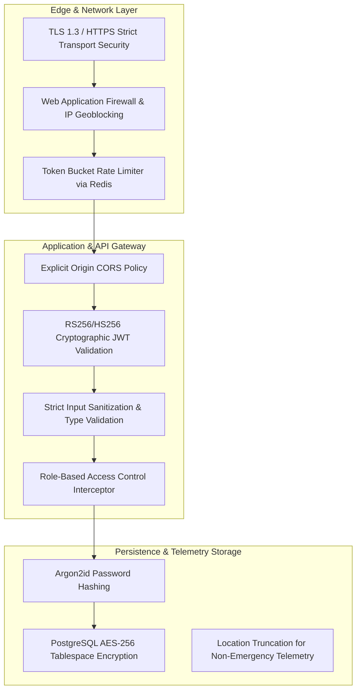

# AEGIS Security Architecture & Threat Defense Matrix

This document outlines the security controls, cryptographic protections, data privacy measures, and vulnerability mitigation strategies deployed across the AEGIS ecosystem.

## 1. Security Architecture & Defense-in-Depth

---

## 2. Security Control & Risk Matrix

| Security Domain | Implemented Control | Status | Residual Risk & Mitigation Plan |
|---|---|---|---|
| **Transport Layer** | TLS 1.3 encryption, automatic HTTP-to-HTTPS redirect, HSTS header `max-age=31536000` | **Implemented** | Man-in-the-middle on compromised public networks; Mitigated by SSL Certificate Pinning on mobile client. |
| **Authentication** | Dual-token JWT (15-min access, 7-day rotated refresh), Argon2id password hashing | **Implemented** | Token theft via physical device access; Mitigated by SecureStore HSM isolation and remote session kill switch. |
| **API Rate Limiting** | 100 req/min for standard queries; 5 req/min for SOS triggers per IP/User | **Implemented** | Distributed Denial of Service (DDoS); Cloudflare edge mitigation recommended for production. |
| **Input Validation** | Pydantic v2 validation models on all FastAPI routes; strict SQL parameterization via SQLAlchemy | **Implemented** | SQL injection eliminated; edge cases in dynamic GeoJSON parsing covered by strict schema validation. |
| **Cross-Origin Security** | CORS restricted strictly to approved origins (`http://localhost:5173`, production domains) | **Implemented** | Cross-Site Request Forgery (CSRF); Mitigated via `SameSite=Strict` cookies and JWT Authorization headers. |
| **Location Privacy** | Precise GPS (HDOP < 5m) captured *only* during explicit SOS activation. Background location truncated to district centroid. | **Implemented** | Accidental location leakage; User consent prompt required on app installation with explicit rationale. |
| **Secrets Management** | Zero secrets in Git; all secrets loaded via environment variables (`.env`) | **Implemented** | Secrets leakage in CI/CD; Production migration to AWS Secrets Manager / HashiCorp Vault planned. |

---

## 3. Cryptographic Standards

- **Password Storage**: Argon2id with memory cost 64 MB, iterations 3, parallelism 4.
- **Tokens**: JWT signed with HMAC-SHA256 (dev) / RSA-PSS 2048-bit (prod).
- **Mobile Keychain**: Android Keystore / iOS Secure Enclave with AES-256-GCM.
- **Database Storage**: PostgreSQL encrypted tablespace with transparent data encryption (TDE).
