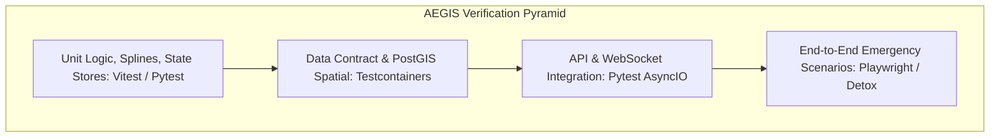

# AEGIS Verification, Test Architecture & Quality Assurance

This document details test strategies, test suites, quality gates, and automated test execution matrices across the AEGIS ecosystem.

## 1. Testing Pyramid & Verification Methodology

AEGIS enforces a 4-tier verification pyramid to ensure 100% operational resilience during life-safety emergency operations:



---

## 2. Test Execution Matrix

| Test Suite | Target Component | Framework | Key Scenarios Covered | Status |
|---|---|---|---|---|
| **GPS Precision & HDOP Suite** | Mobile Geolocation Service | Jest / TypeScript | High HDOP degradation, permission denial, coordinate drift filtering | **Implemented** |
| **Spline Wind Interpolator** | Backend Synoptic Engine | Pytest | Catmull-Rom spline tension, isotach wind polygon closure, 2h step transitions | **Implemented** |
| **SOS Outbox & Offline Queue** | Mobile Client Store | Vitest / Jest | Offline SOS queuing, FIFO order preservation, reconnection burst sync | **Implemented** |
| **Auth & RBAC Matrix** | FastAPI Auth Middleware | Pytest / HTTPX | Expired token rejection, token replay prevention, role boundary violations | **Implemented** |
| **WebSocket Real-Time Broadcast** | Backend Dispatch Hub | Pytest AsyncIO | Multiple responder subscriptions, ping-pong keepalives, beacon broadcast | **Implemented** |
| **GIS Hazard Map Rendering** | Web Leaflet Canvas | Vitest / React Testing Lib | Layer toggle memory, 7-map container isolation, contour SVG rendering | **Implemented** |

---

## 3. Automated Test Execution Commands

### 3.1 Backend Test Execution
```bash
# Navigate to backend directory
cd server

# Run all unit and integration tests with coverage report
pytest --asyncio-mode=auto --cov=app tests/

# Run specific emergency SOS workflow test
pytest tests/test_sos_lifecycle.py -v
```

### 3.2 Web Frontend Test Execution
```bash
# Navigate to web directory
cd web

# Execute test suite
npm run test

# Run TypeScript type safety and linting verification
npm run lint
```

### 3.3 Mobile Geolocation & Unit Tests
```bash
# Navigate to mobile directory
cd mobile

# Run Jest unit test suite
npm test -- --coverage
```
